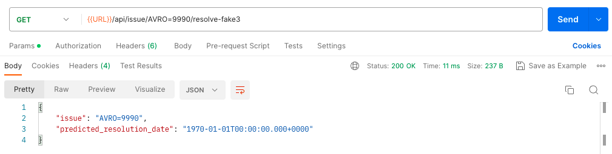

# JIRA Issues Resolution Date Prediction

The project focuses on using machine learning to predict issue resolution times for JIRA, a popular issue tracking and project management tool for software projects.

## Project Details

The goal of the project is to create a web service with three REST endpoints. These endpoints take a JIRA issue key (e.g. AVRO-2171) and predict when that issue will reach the 'Resolved' status.

Tasks include:

1. Implementing an endpoint that runs a (fake) hardcoded resolution for a single issue.
2. Implementing an endpoint that predicts the resolution date for a single issue in the dataset. This should respond whether the issue is already resolved or not, and return 'HTTP 404' if the issue does not exist.
3. Implementing an API endpoint which retrieves all unresolved issues (along with their predicted resolution dates) at the time of the API call and are expected to be resolved by a specified date (in ISO-8601 format).

In this project there are 2 functions were created to handle the raw dataset 'avro_issue.csv':

1. 'preprocessing.py' preprocesses and transforms the data into a suitable format and shape for the modeling phase.
2. 'predict.py' is the last function that takes the raw dataset, preprocesses it, and then apply the saved Linear Regression model (the model work exist in the 'ML Predictive Model Notebook.ipynb' file) 

Also, there are 2 unit test files to test all of the above functions:
1. test_preprocess_data.py
2. test_predict_resolution_date.py

## Getting Started

### Prerequisites

Ensure you have the following installed:

- Python 3.8 or higher
- pip (Python package installer)
- venv (Python virtual environment)
- Postman (For testing the API)

### Installation (API)

1. Clone the repo: `git clone https://github.com/1ahmaddiab/JIRA_Issues.git`
2. Navigate to the project directory: `cd My Github Project`
3. Navigate to the project directory: `cd API`
4. Create a new Python virtual environment: `python3 -m venv env`
5. Activate the virtual environment: `source env/bin/activate`
6. Install the necessary Python packages: `pip install -r requirements.txt`
7. If needed for sklearn on different machine: `pip install -U scikit-learn`

### Installation (Modeling)

1. Clone the repo: `git clone https://github.com/1ahmaddiab/JIRA_Issues.git`
2. Navigate to the project directory: `cd My Github Project`
3. Navigate to the project directory: `cd Modeling`
4. Create a new Python virtual environment: `python3 -m venv env`
5. Activate the virtual environment: `source env/bin/activate`
<!-- 6. Run in the terminal to install xgboost well: `brew install cmake` -->
6. Install the necessary Python packages: `pip install -r requirements.txt`

## Usage

This project contains a Jupyter Notebook (ML Predictive Model Notebook.ipynb) that outlines the steps taken, including data preprocessing, exploratory data analysis, and model training, tuning, evaluation, and prediction.

The testing work is separated into two projects. One to create, train, and test the models and one to predict the resolution dates by running the model using the API.

### Testing the Model

1. Run all unit test files using: `pytest`

### Testing the API

1. Run in the terminal `export FLASK_APP=app.py`
2. Run the Flask server: `flask run`
3. Test the API using the provided Postman collection.

## Results

1. Implementing an endpoint that runs a (fake) hardcoded resolution for a single issue.

2. Implementing an endpoint that predicts the resolution date for a single issue in the dataset. This should respond whether the issue is already resolved or not, and return 'HTTP 404' if the issue does not exist.

3. Implementing an API endpoint which retrieves all unresolved issues (along with their predicted resolution dates) at the time of the API call and are expected to be resolved by a specified date (in ISO-8601 format).

4. Results of unit testing the created functions (preprocess.py and predict.py)

## Limitations

There were several constraints encountered during the development of this project, mainly due to compatibility issues with the latest MacOS software update.

One such issue was with Docker installation, as the image file was erroneously identified as damaged. Another challenge was installing the 'xgboost' library. The standard method of installation via pip was unsuccessful. The solution required a complex process of installing different versions of 'homebrew', removing Python and Anaconda, and then reinstalling Python. This workaround was time-consuming and not straightforward, but it ultimately led to a successful installation.

Additionally, 'homebrew', a critical tool for the project, initially lacked support for the current MacOS version, which presented further challenges. Although these issues were eventually resolved, they added considerable constraints to the project timeline and workflow.

Due to these time constraints, the main focus of the project was on the 'avro_issues' dataset. For future enhancements, it is recommended to integrate the 'avro_transition' dataset, which provides valuable insights into the lifecycle of an issue, from creation to resolution. Employing process mining techniques on the 'avro_transition' dataset could also prove beneficial in identifying bottlenecks and subsequently developing strategies for faster issue resolution.

## Acknowledgements

